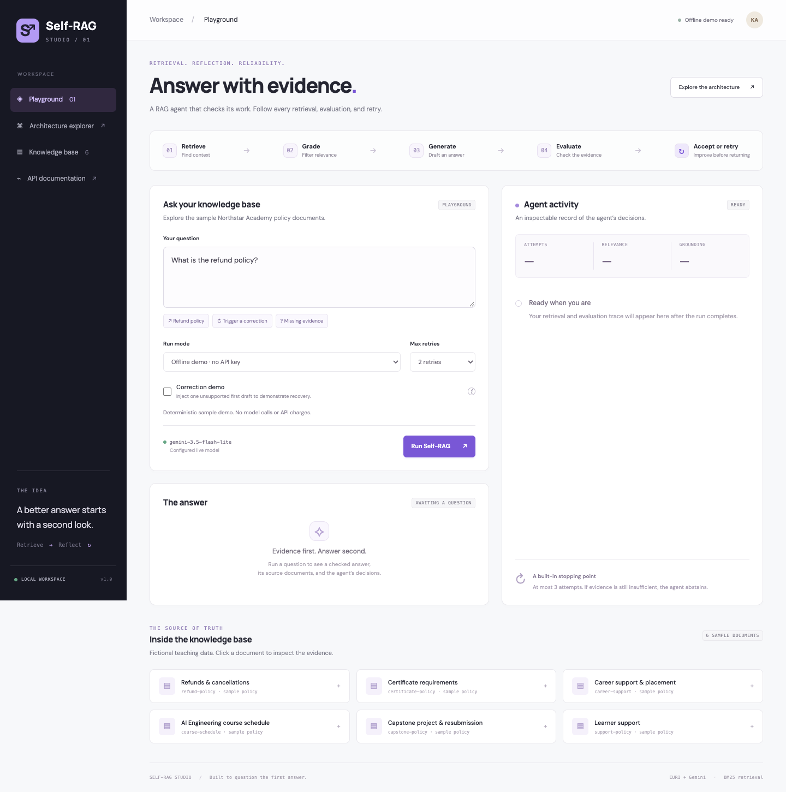
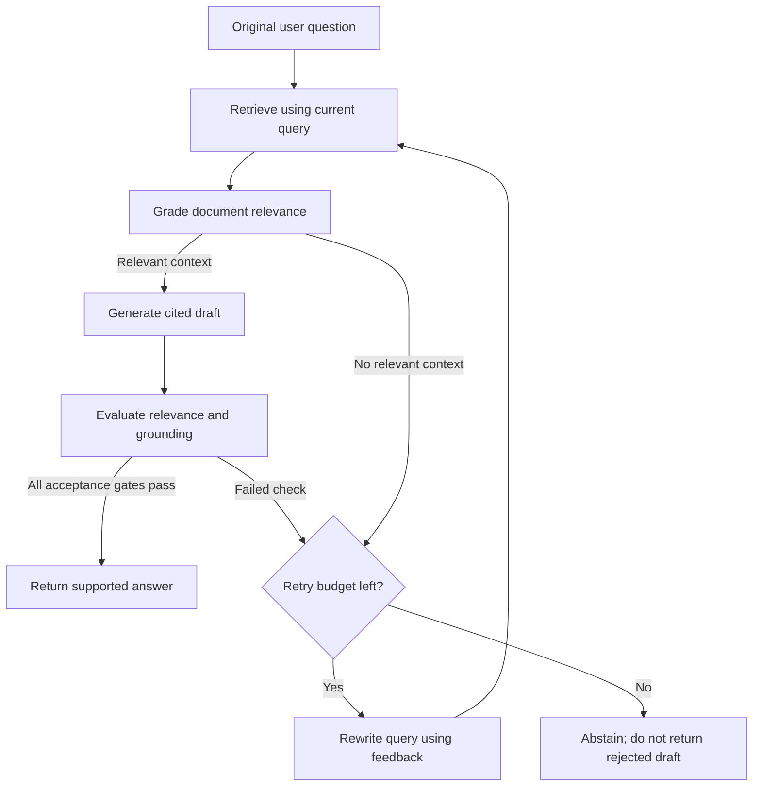

# Self-RAG with Answer Evaluation

**An agent that checks its first answer, corrects unsupported drafts, and stops when evidence runs out.**

Built with FastAPI, a local BM25 retriever, and **`gemini-3.5-flash-lite` through EURI's OpenAI-compatible API**. Includes a web playground, complete evaluation traces, a standalone interactive architecture explorer, automated tests, and a recording guide for the assignment video.



**Verification:** 40 automated tests and desktop/mobile browser checks passed. Live EURI testing requires your key. See the precise [verification record](docs/TEST_RESULTS.md).

## Start in two minutes

Requires Python **3.11+**; Python 3.12 is recommended and was used for local verification.

```bash
python3 -m venv .venv
source .venv/bin/activate
python -m pip install -r requirements-dev.txt
cp .env.example .env
python -m uvicorn app.main:app --host 127.0.0.1 --port 8000
```

Windows PowerShell activation: `.venv\Scripts\Activate.ps1`. Copy the environment example with `Copy-Item .env.example .env`.

Open:

- **Playground:** http://127.0.0.1:8000
- **Architecture explorer:** http://127.0.0.1:8000/architecture
- **Interactive API docs:** http://127.0.0.1:8000/docs

The default **Offline demo** runs immediately without a key. It is deterministic and extractive, uses keyword relevance and exact-passage grounding, and makes no model calls. Select **Live · EURI / Gemini** to use real model-based grading, generation, evaluation, and query rewriting.

## Configure the requested EURI model

Edit your private `.env`:

```dotenv
EURI_API_KEY=your_actual_key_here
EURI_BASE_URL=https://api.euron.one/api/v1/euri
EURI_MODEL=gemini-3.5-flash-lite
```

The variable is **`EURI_API_KEY`**, including the `I`. The key stays on the backend; it is never sent to the browser or included in traces. `.env` is ignored by Git and Docker. Existing shell environment variables take precedence over `.env`; restart the server after changing a key that was already loaded.

The client uses the requested SDK pattern:

```python
import os
from openai import OpenAI

client = OpenAI(
    api_key=os.environ["EURI_API_KEY"],
    base_url="https://api.euron.one/api/v1/euri",
)

resp = client.chat.completions.create(
    model="gemini-3.5-flash-lite",
    messages=[
        {"role": "system", "content": "You are a helpful assistant."},
        {"role": "user", "content": "Write a haiku about the ocean."},
    ],
    temperature=0.7,
)
print(resp.choices[0].message.content)
```

The standalone example also loads `.env` for you:

```bash
python scripts/euri_example.py
python scripts/run_examples.py --mode live
```

Live verification requires a valid EURI key with access to this exact model. The project never silently switches models or presents an offline answer as a live result. A configured key does not prove that the account has model access. The UI and saved results identify which mode actually ran.

## Try these three examples

| Scenario | Question | Settings | Expected result |
|---|---|---|---|
| First-pass success | What is the refund policy? | Correction demo off | Supported answer: full refund within 7 calendar days, with less than 20% completion; source citation included. |
| Correction / retry | Does Northstar Academy guarantee a job or salary? | Correction demo on; at least 1 retry | First draft rejected; search rewritten; new context retrieved and graded; corrected answer states there is no employment or salary guarantee. |
| Missing evidence | What is the lunar observatory telescope diameter? | 2 retries | At most 3 attempts, then abstention because the knowledge base has no supporting evidence. |

**Correction demo is explicit fault injection.** After generating the first draft, the pipeline replaces it with the deliberately false claim “Northstar Academy guarantees every learner a job paying ₹50 lakh per year.” The evaluator actually audits this draft; its decision is not hardcoded in the orchestrator. Live mode uses the real EURI judge. Every retry performs retrieval, grading, generation, and evaluation again when relevant context exists. The flag only affects the first attempt and is visibly marked in the trace.

This makes the correction path reproducible for a presentation without pretending a model naturally made a specific mistake. With the flag off, the same retry machinery handles genuine low-quality answers. Live model judgments are probabilistic; inspect the trace if a run behaves differently.

Run all scenarios and save JSON evidence:

```bash
python scripts/run_examples.py --mode demo
python scripts/run_examples.py --mode live  # requires a real key; incurs API usage
```

Results are written to ignored `artifacts/demo/` or `artifacts/live/`. The runner exits nonzero if the observed outcomes do not match the intended demonstrations. It never substitutes fixture results for a failed live call.

## How the agent works



1. **Retrieve:** BM25 ranks local policy documents; default top K is 3. Zero-score documents are excluded. Each supplied policy is already a short passage, so there is no additional chunking step.
2. **Grade documents:** Score each passage against the **original question** and retain relevance scores of at least **0.55**. In live mode the LLM returns strictly validated JSON with exactly one grade per retrieved document.
3. **Generate:** Give the model only retained context and previous feedback. Require exact `[document-id]` citations. Skip generation when no relevant passages survive.
4. **Evaluate:** A separate model call audits whether the draft answers the original question and whether every factual claim is supported by the same context. It returns scores, a support boolean, unsupported claims, and actionable feedback.
5. **Accept or correct:** Accept only if every condition below passes. Otherwise, rewrite the search query and repeat retrieval while budget remains.

| Acceptance gate | Requirement |
|---|---|
| Context relevance | Only documents graded ≥ 0.55 reach generation |
| Answer relevance | ≥ 0.75 |
| Grounding | ≥ 0.85 |
| Support judgment | `supported == true` |
| Unsupported claims | Empty list |
| Citations | At least one citation, and every cited ID is in the retained context |
| Draft | Nonempty |

Scores are judge estimates, **not calibrated probabilities**. Citation validation checks IDs; the grounding judge checks semantic support. The original question is preserved during all rewrites so the agent cannot make an easier question pass instead.

### Retry and failure behavior

`max_retries` counts **additional** attempts. `max_retries=2` means at most **3 total attempts**; `0` means one attempt. The API allows 0–4 retries. Only an accepted draft enters the final `answer`; rejected drafts remain labeled in the diagnostic trace. Exhaustion returns `status: "abstained"`, an explanation, and no accepted sources.

Invalid judge JSON, duplicate/missing document grades, EURI authentication errors, or provider outages fail closed with an actionable HTTP 502. They do not produce a successful answer and are separate from semantic correction retries. Each SDK request has a 45-second timeout and at most one transport retry. A first-pass live run normally makes 4 logical model calls; a failed answer plus one successful retry normally makes 9. SDK retries can add requests and cost.

## Interactive architecture visualizer

Open [`docs/architecture_visualizer.html`](docs/architecture_visualizer.html) directly in a browser, or visit `/architecture` while the server runs. It is a **single self-contained HTML file**, inspired by the guided exploration style of [your Vector Similarity reference](https://github.com/AIWITHKAUSHAL/Vector_Similiarity/blob/main/docs/architecture_visualizer.html).

- Clickable SVG nodes with inputs, outputs, explanations, and actual source snapshots.
- Play/pause, next/back, reset, and playback speed controls.
- Three scenarios captured from actual offline pipeline execution.
- Per-attempt retrieval counts, grades, grounding, final outcome, and raw JSON.
- Keyboard-accessible nodes and controls; responsive layout.
- No API keys, external scripts, or network calls required by the explorer.

Rebuild embedded source and traces after code changes:

```bash
python scripts/build_visualizer.py
```

The explorer is a teaching playback of recorded **offline** runs; use the playground for fresh live executions. CI checks that the generated explorer matches the current source.

## API and CLI

```bash
curl -X POST http://127.0.0.1:8000/api/query \
  -H 'Content-Type: application/json' \
  -d '{"question":"What is the refund policy?","mode":"demo","max_retries":2,"top_k":3,"correction_demo":false}'

python -m app.cli "What is the refund policy?"
python -m app.cli "Does Northstar Academy guarantee a job or salary?" --correction-demo
python -m app.cli "What is the refund policy?" --mode live
```

`POST /api/query` returns `status`, `answer`, `mode`, `model`, `attempt_count`, `retries_used`, `sources`, `thresholds`, `attempts`, `events`, and timing. Each attempt contains the search query, retrieved passages and BM25 scores, relevance grades, retained IDs, draft, evaluation, and rewritten query. The browser displays the completed trace after the request finishes; it does not simulate streaming model progress.

Other routes: `GET /api/health` reports key presence and configuration without revealing credentials; `GET /api/documents` exposes the sample corpus for inspection.

## Project map

```text
app/
  main.py               FastAPI routes and static frontend
  pipeline.py           Bounded Self-RAG loop and acceptance rules
  providers.py          EURI prompts, structured judges, offline provider
  retrieval.py          Dependency-free local BM25 ranking
  models.py             Request and judge schemas
  config.py             Server-only EURI configuration
  cli.py                Terminal runner
  static/               HTML, CSS, and JavaScript playground
data/knowledge_base.json Six fictional Northstar Academy policy passages
docs/
  architecture_visualizer.html   Standalone generated explorer
  VIDEO_SCRIPT.md                Recording plan and narration
  SUBMISSION.md                  GitHub and YouTube handoff checklist
  TEST_RESULTS.md                Local verification record
scripts/
  euri_example.py        Minimal requested live SDK example
  run_examples.py        Execute and export three scenarios
  build_visualizer.py    Embed actual traces and source in the explorer
  visualizer_template.html
  browser_smoke.py       Optional browser verification
tests/                  Pipeline, provider, and API regression tests
.github/workflows/      GitHub Actions checks without a secret key
```

## Tests

```bash
python -m pytest -q
```

Tests cover first-pass acceptance, full correction cycles, irrelevance filtering, all acceptance gates, citation failures, retry limits including zero, empty retrieval, original-question preservation, feedback propagation, malformed grading JSON, incomplete grades, EURI SDK configuration, sanitized provider errors, input validation, and HTTP assets. Provider contract tests use fakes; they do not claim to verify the live EURI service.

Optional browser smoke check (requires Playwright and Chrome):

```bash
python -m pip install playwright
python scripts/browser_smoke.py
```

Start the server first. The browser script uses installed Google Chrome, checks desktop and mobile views, exercises all three scenarios, verifies explorer playback, and saves screenshots under `artifacts/`.

## Docker

```bash
docker compose up --build
```

The service binds to localhost:8000. A local `.env` is optional for offline mode. The image runs as a non-root user. If port 8000 is already occupied, stop the other service or change the published port in `compose.yaml`.

## Custom knowledge and limitations

Edit `data/knowledge_base.json` to add short passages with unique `id`, `title`, and `text` fields. Documents are loaded on each request, so corpus edits are available immediately. Rebuild the explorer after changing the sample data if you want its embedded examples to match.

This is an educational Self-RAG control workflow, not a reimplementation of the research paper's trained reflection-token model. BM25 is lexical and can miss synonyms; the offline grader is only a teaching approximation. Live generation and judging use separate calls to the same requested model, which can make correlated errors. A passed judge score is not proof of truth. There is no persistent vector database, external web search, user authentication, or public-service rate limiting; keep this local demonstration on localhost unless you add appropriate hosting controls. The playground's optional Google Fonts request has system-font fallbacks.

## Assignment submission

See [`docs/VIDEO_SCRIPT.md`](docs/VIDEO_SCRIPT.md) for a 6–8 minute walkthrough showing code, first-pass success, correction, and retry exhaustion. See [`docs/SUBMISSION.md`](docs/SUBMISSION.md) for the GitHub/YouTube steps. The actual repository and video links must be filled in after publishing; this project does not fabricate an uploaded video or a completed live test.

Technical references: [FastAPI testing](https://fastapi.tiangolo.com/tutorial/testing/), [OpenAI Python SDK](https://github.com/openai/openai-python), and [Gemini 3.5 Flash-Lite model documentation](https://ai.google.dev/gemini-api/docs/models/gemini-3.5-flash-lite). EURI endpoint configuration follows the assignment's supplied example; availability is determined by your EURI account.
